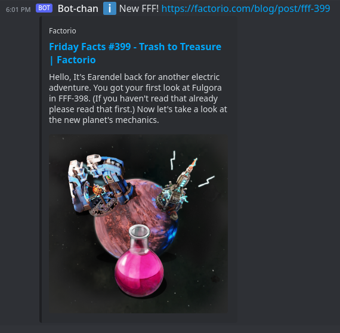

# My Cogs for [Red Discord Bot](https://github.com/Cog-Creators/Red-DiscordBot)

Repository name CCCogs
Cogs:

* [FactorioCogFriday](./factoriocogfriday/README.md)
* [BroadcastBoxLive](./broadcastboxlive/README.md)

## Installation Instructions

### Prerequisite

First make sure the downloader cog is loaded. To check, run:

```console
[p]cogs
```

`downloader` should be he in the loaded category. To check, run:

```console
[p]load downloader
```

For official information on the downloader cog, see [Red Discord Bot’s documentation](https://docs.discord.red/en/stable/cog_guides/downloader.htm)

Next add my repository with

```console
[p]repo add CCCogs https://github.com/ChaseCares/CCCogs
```

`CCCogs` will be the name of the repository

## FactorioCogFriday

Name `factoriocogfriday`.
Short name `[p]fcf`.
Run `[p]help fcf` for help.

Factorio is a construction and management simulation game, that publishes regular blogs called Factorio Friday Facts. This cog checks for an update every 6 hours (as to not be too intrusive) and since a notification when a new FFF is published. Only does one network request to factorio.com per Red-DiscordBot instance, regardless of how many guilds the bot is in.



[More info about FactorioCogFriday](./factoriocogfriday/README.md)

## BroadcastBoxLive

Name `broadcastboxlive`.
Short name `[p]bbl`.
Run `[p]help bbl` for help.

[Broadcast Box](https://github.com/Glimesh/broadcast-box) lets you broadcast to others in sub-second time. This cog is designed to monitor the status page have a Broadcast Box instance and show who is currently streaming.


[More info about BroadcastBoxLive](./broadcastboxlive/README.md)

## Unload Cog and Remove Repository Instructions

To unload a cog

```console
[p]unload <cogname>
```

To remove a repository

```console
[p]repo delete <reponame>
```
